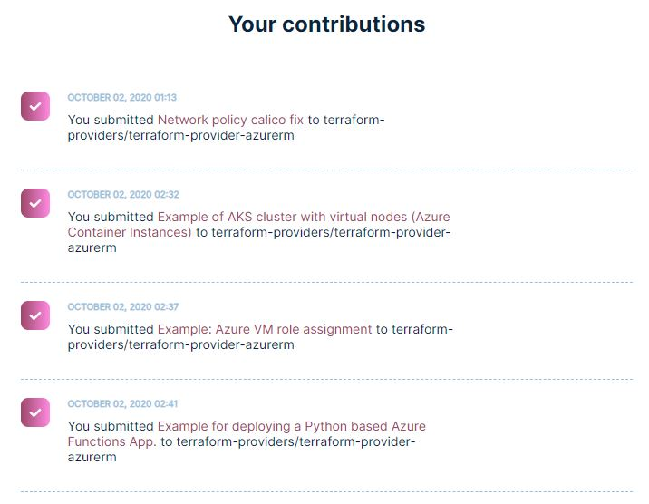

We all use open source software. Our lives wouldn't be the same without it. Android OS powers millions of cell phones used daily. Likewise, Linux OS is another example of open source software that countless small and large business depend on to literally run their IT infrastructure. There are entire industries spawned and developed around open source products. It proliferates into all aspects of our society.

In the same way, I am a frequent consumer of open source software in my daily personal and professional life. Unfortunately, with all other happenings and priorities in life, I don't have much time to be involved in the open source community. Not nearly as much as I desire to. However, this year I decided to take part and participate in DigitalOcean's annual month-long [Hacktoberfest](https://hacktoberfest.digitalocean.com/) event. I think it provides a great opportunity to take some time over few weeks and re-focus some of my energy to contribute back to the open source community. 

I am a big fan and user of HashiCorp [Terraform](https://www.terraform.io/), especially their [Azure Terraform provider](https://github.com/terraform-providers/terraform-provider-azurerm). As such, I wanted to give back to the product I use frequently and also help others learn and apply the platform. So I thought the best way to accomplish that was to use my experience and add samples to the collection of [examples](https://github.com/terraform-providers/terraform-provider-azurerm). By providing some reference implementations, my hope is that others find them useful in solving their problems in the future. And it also helped close few open issues in the repository along the way. As a bonus, I ended up learning few new things about Terraform and Azure too!

 

Overall, my first Hacktoberfest was a great experience. It's a great initiative to promote open source communities and contributions. I really feel that the event is a positive force in the IT and OSS ecosystem, and I hope it continues to inspire people to create more PR's.