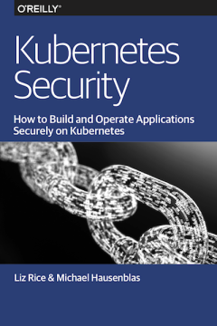

Over the past few weeks, I've had some free time and took the opportunity to read a few books on Kubernetes.  Most of these books are available for free online, so would make great reading material for those new to Kubernetes and looking to learn more on the subject. I've included links to the online versions where available. Here are some hasty reviews of several of them.

### Kubernetes: Up and Running

[Kubernetes: Up and Running](https://www.oreilly.com/library/view/kubernetes-up-and/9781492046523/) is a relatively short book at just above ~250 pages and is a very quick read. I found it to be a good introduction to the subject written in a very approachable manner. The writing is always easy to understand and explanations are clear and concise. It is a very much an introductory level book. As such, the book does not go very deep into technical details of Kubernetes. However, the book does a great job of describing all of the critical components ranging from containers, and pods, to RBAC, secrets, and storage and examines common use cases. As various topics are introduced, the writers provide useful context and coding examples illustrating the concept. A later chapter with several real-world deployment examples (e.g. Redis on Kubernetes) helps demonstrate how various components fit together into a complete solution. It's interesting to note that the book also includes an appendix that reviews building a Kubernetes cluster on Raspberry Pi devices. 

The book is available as a [free e-book](https://azure.microsoft.com/en-us/resources/kubernetes-up-and-running/) from Microsoft Azure.

### Hands-On Kubernetes on Azure

[Hands-On Kubernetes on Azure](https://azure.microsoft.com/en-us/resources/get-started-with-kubernetes-on-azure/) is another introductory level book specifically focused on Azure Kubernetes Service. The book does a great job of giving an overview of Kubernetes concepts. The content is directed towards a target audience familiar with Azure and application developers in particular. The text is not technically heavy, but it does cover a wide range of topics. The ideas described in the chapters are nicely illustrated using realistic examples that include custom web applications, or off-the-shelf products such as Redis and WordPress. In terms of Azure specific content, there are sections that cover integrations to Azure AD for RBAC, KeyVault, Azure EventHubs, Azure Monitor, Azure Container Registry, and Azure Functions. A few interesting topics discussed in the book are deployment of Azure Functions as Docker images in Kubernetes, Let's Encrypt integration for automatic certificates, and use of [KEDA](https://keda.sh/) (Kubernetes-based Event Driven Autoscaling) for event driven pod autoscaling.

### Operating Kubernetes Clusters and Applications Safely

[Operating Kubernetes Clusters and Applications Safely](https://kubernetes-security.info/) is a book that tries to cover security in the Kubernetes technology landscape. This is an extremely important topic for anybody looking to understand Kubernetes at a deep level or utilize the technology in an enterprise production environment. This is a very short book at only around 80 pages and only gives a very brief overview of security related subject matter. Content-wise, there isn't really much in here that anybody with a good understanding of Kubernetes would not already be familiar with. The biggest value this book brings are the very numerous links to supplementary online material (e.g. blog posts, white papers) that allows one to delve deeper into various topics.

### Kubernetes Patterns Reusable Elements for Designing Cloud-Native Applications

 

[Kubernetes Patterns: Reusable Elements for Designing Cloud-Native Applications](https://k8spatterns.io/) attempts to take on a different approach to explaining various Kubernetes concepts. The authors intention was to write a book for application developers and connect familiar application development patterns to Kubernetes primitives and ideas. The book doesn't waste time covering the basics of Docker or history or Kubernetes, and instead promptly starts of with Kubernetes core concepts. The book is well structured, starting with fundamentals (e.g. pods, services, etc) and gradually moving to more advanced concepts. Later advanced sections of the book cover topics such as sidecar/adapter/ambassador patterns and operators. Each chapter is written in problem - solution - discussion format, making it easy for the reader to understand the typical use case for each topic discussed.  However, I sometimes had the impression that the "patterns" were being forced to fit into the Kubernetes world, and didn't quiet naturally belong. My other complaint with this book is that the examples were not really anything grounded in real world scenarios. All or most examples are presented using a random number generator application. It seems trivial and contrived, without effectively connecting the ideas discussed in the chapter to a realistic use case. In my opinion, the authors missed an great opportunity. It would have been far more effective if topics were illustrated with scenarios actually used in production systems. For anybody familiar with Kubernetes (familiar enough to pass CKAD/CKA), there isn't much new here. Each chapter ends with links to additional references or related topics, which I did find useful and valuable. Further, this book does make a really good reference at your desk.

The book is available as a [free e-book](https://www.redhat.com/en/resources/oreilly-kubernetes-patterns-cloud-native-apps) from Red Hat.